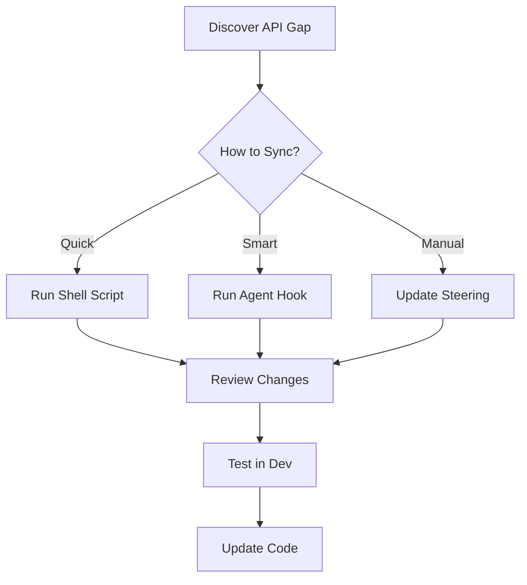

# Devvit Quick Reference Card

**Version**: 0.12.4-dev | **Last Updated**: 2025-11-18

## 🚀 Quick Start

```bash
# Sync documentation
npm run sync-docs
# or
./scripts/sync-devvit-docs.sh
# or
node scripts/sync-devvit-docs.js

# Run agent hook
# Command Palette → "Sync Devvit Documentation"
```

## 📚 Documentation Locations

| Resource | Location | Purpose |
|----------|----------|---------|
| Quick Reference | `.kiro/steering/devvit-api-reference.md` | Common methods (always loaded) |
| Constraints | `.kiro/steering/devvit-constraints.md` | Platform limitations |
| Maintenance Guide | `.kiro/steering/devvit-docs-maintenance.md` | Complete guide |
| Complete API | `docs/devvit-api/` | Full API cache |
| Sync Reports | `docs/devvit-sync-report-*.md` | Change history |

## 🔍 Finding Information

### 1. Check Steering Files First
```
.kiro/steering/devvit-api-reference.md
```
Contains commonly-used methods with examples.

### 2. Search MCP Server
```typescript
mcp_devvit_mcp_devvit_search({ query: "method name" })
```

### 3. Check GitHub (Source of Truth)
```
https://github.com/reddit/devvit/tree/main/devvit-docs/docs/api
```

### 4. Check Local Cache
```
docs/devvit-api/RedditAPIClient.md
docs/devvit-api/models/User.md
```

## ⚠️ Critical Constraints

### Redis: NO Regular Sets!
```typescript
// ❌ WILL FAIL
await redis.sAdd('key', ['value']);

// ✅ USE SORTED SETS
await redis.zAdd('key', { member: 'value', score: Date.now() });
```

### Realtime: Underscores Only
```typescript
// ❌ WRONG
await realtime.send('chat-messages', data);

// ✅ CORRECT
await realtime.send('chat_messages', data);
```

### Auth: Use context.userId
```typescript
// ❌ WRONG
const userId = await reddit.getCurrentUserId(); // doesn't exist

// ✅ CORRECT
const { userId } = context;
```

## 🔄 Sync Workflow



## 📊 When to Sync

| Trigger | Action | Priority |
|---------|--------|----------|
| Weekly | Run agent hook | Medium |
| Version update | Run sync script | High |
| Method not found error | Manual check GitHub | Critical |
| New feature | Check steering files | Medium |
| Before deployment | Run agent hook | High |

## 🛠️ Common Tasks

### Add New Method to Reference
1. Find method in GitHub docs
2. Test with MCP server
3. Add to `.kiro/steering/devvit-api-reference.md`
4. Include example code

### Document New Constraint
1. Identify limitation through error
2. Create reproduction example
3. Add to `.kiro/steering/devvit-constraints.md`
4. Include workaround

### Update After Version Change
1. Update package.json
2. Run `node scripts/sync-devvit-docs.js`
3. Review sync report
4. Update steering files
5. Test breaking changes

## 🔗 Key Links

- **GitHub Repo**: https://github.com/reddit/devvit
- **API Docs**: https://github.com/reddit/devvit/tree/main/devvit-docs/docs/api
- **RedditAPIClient**: https://github.com/reddit/devvit/blob/main/devvit-docs/docs/api/redditapi/RedditAPIClient/classes/RedditAPIClient.md
- **Devvit Docs**: https://developers.reddit.com/docs
- **r/devvit**: https://www.reddit.com/r/devvit

## 💡 Pro Tips

1. **Always check GitHub first** - It's the source of truth
2. **MCP lags behind** - Don't rely solely on MCP search
3. **Cache locally** - Keep full API docs in `docs/devvit-api/`
4. **Document patterns** - Add common patterns to steering files
5. **Test thoroughly** - Runtime errors reveal undocumented constraints

## 🐛 Troubleshooting

### "Method not found" Error
1. Check GitHub docs for method existence
2. Verify spelling and casing
3. Check if method is deprecated
4. Update local cache

### MCP Returns No Results
1. Method might be too new
2. Check GitHub directly
3. Add to steering files manually
4. Report gap in sync report

### Sync Script Fails
1. Check network connection
2. Verify GitHub API rate limits
3. Try manual curl commands
4. Check file permissions

---

**Quick Access**: Bookmark this file for instant reference!
